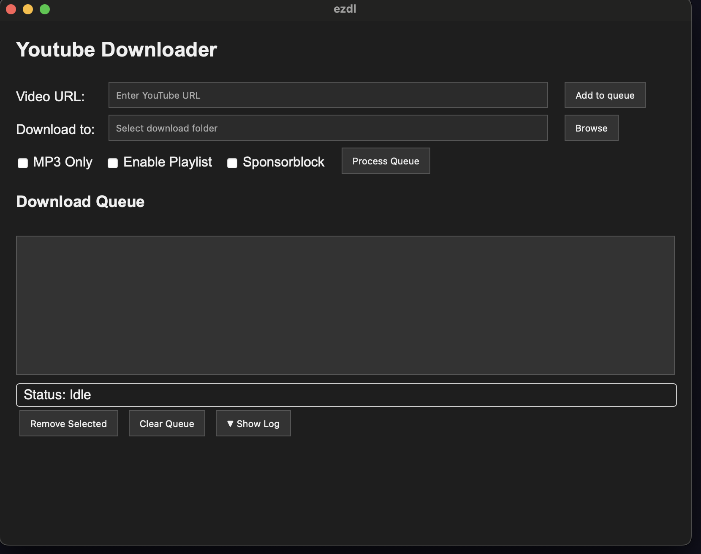

# EZDL (Tauri + youtube-dl + FFmpeg)

A lightweight, cross-platform YouTube downloader built with [Tauri](https://tauri.app/), leveraging [`youtube-dl`](https://github.com/ytdl-org/youtube-dl) and [`ffmpeg`](https://ffmpeg.org/) for media extraction and conversion.



---

## 🚀 Features

- Download videos or audio directly from YouTube (and other supported sites)
- Automatic MP3/MP4 conversion via FFmpeg
- Clean, minimal UI built with modern web tech
- Native performance and small binary size (thanks to Tauri)
- Cross-platform: macOS, Linux, Windows

---

## 🧩 Build Requirements

Before building or running, ensure the following dependencies are available in your environment:

- **Node.js** (>= 18.x)
- **Rust** (for Tauri backend)
- **youtube-dl** or **yt-dlp**
- **FFmpeg**

### Install on Linux (example)

```bash
sudo apt install ffmpeg
pip install -U yt-dlp

